> **Important Note — Model Selection:**
> This project was originally designed and implemented using **Xception** (Extreme Inception) as the backbone CNN, which is a larger and more powerful architecture (22.9M parameters, 299×299 input). During training on Google Colab, Xception achieved ~99% validation accuracy within 7 epochs of Phase 1. However, after **over 20 failed training attempts spanning 3 days** — caused by repeated GPU quota exhaustion, Colab session timeouts, and runtime disconnections — it became impractical to complete the full training pipeline with Xception. The model was therefore switched to **MobileNetV2** (3.4M parameters, 224×224 input), a lightweight and efficient architecture that trains approximately **6× faster** while still delivering strong classification performance. The entire pipeline, training strategy, and evaluation methodology remain identical — only the base CNN was changed.

---

## Table of Contents

1. [Project Overview](#1-project-overview)
2. [Dataset Description](#2-dataset-description)
3. [System Architecture](#3-system-architecture)
4. [Environment Setup](#4-environment-setup)
5. [Data Exploration & Analysis](#5-data-exploration--analysis)
6. [Data Preprocessing & Augmentation](#6-data-preprocessing--augmentation)
7. [Model Architecture](#7-model-architecture)
8. [Training Strategy](#8-training-strategy)
9. [Evaluation & Metrics](#9-evaluation--metrics)
10. [Visualization & Interpretation](#10-visualization--interpretation)
11. [Model Saving & Deployment](#11-model-saving--deployment)
12. [Inference Pipeline](#12-inference-pipeline)
13. [Results Summary](#13-results-summary)

---

## 1. Project Overview

### 1.1 Objective

Build an automated fruit recognition system capable of classifying images into **15 distinct fruit categories** using deep learning. The system leverages **Transfer Learning** with the **MobileNetV2** architecture pretrained on ImageNet to achieve high classification accuracy with efficient training time.

### 1.2 Approach

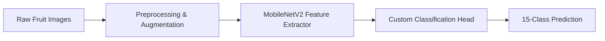

### 1.3 Key Specifications

| Specification | Value |
|---------------|-------|
| **Task** | Multi-class Image Classification |
| **Classes** | 15 fruit categories |
| **Total Images** | 70,549 |
| **Model** | MobileNetV2 (Transfer Learning) |
| **Input Size** | 224 × 224 × 3 (RGB) |
| **Framework** | TensorFlow / Keras |
| **Training Platform** | Google Colab / Kaggle (T4 GPU) |
| **Training Strategy** | 2-Phase (Frozen → Fine-tuning) |

---

## 2. Dataset Description

### 2.1 Source

- **Name:** Fruit Recognition Dataset
- **Platform:** Kaggle
- **Author:** Chris Gorgolewski
- **URL:** https://www.kaggle.com/datasets/chrisfilo/fruit-recognition
- **License:** CC BY 4.0

### 2.2 Dataset Statistics

| Property | Value |
|----------|-------|
| Total images | 70,549 |
| Number of classes | 15 |
| Image resolution | 320 × 258 pixels (original) |
| Color space | RGB (8 bits/channel) |
| Camera | HD Logitech webcam (5MP) |
| Collection period | 6 months |

### 2.3 Class Distribution

| Class | Images | Percentage |
|-------|--------|------------|
| Guava | 19,698 | 27.9% |
| Apple | 11,185 | 15.9% |
| Kiwi | 8,465 | 12.0% |
| Mango | 4,154 | 5.9% |
| Banana | 3,027 | 4.3% |
| Orange | 3,012 | 4.3% |
| Pear | 3,012 | 4.3% |
| Peach | 2,629 | 3.7% |
| Pitaya | 2,501 | 3.5% |
| Plum | 2,298 | 3.3% |
| Tomatoes | 2,171 | 3.1% |
| Pomegranate | 2,167 | 3.1% |
| Carambola | 2,080 | 2.9% |
| Muskmelon | 2,078 | 2.9% |
| Persimmon | 2,072 | 2.9% |

> **Note:** The dataset is imbalanced — Guava alone accounts for ~28% of all images, while the smallest classes (Carambola, Muskmelon, Persimmon) each have ~2,000 images.

### 2.4 Dataset Folder Structure

```
fruit-recognition/
├── Apple/
│   ├── Red Apple/
│   ├── Green Apple/
│   └── ... (6 sub-categories)
├── Banana/
├── Carambola/
├── Guava/
├── Kiwi/
│   └── ... (3 sub-categories)
├── Mango/
│   └── ... (3 sub-categories)
├── Orange/
├── Peach/
├── Pear/
├── Persimmon/
├── Pitaya/
├── Plum/
├── Pomegranate/
├── Tomatoes/
└── muskmelon/
```

Each fruit class folder may contain sub-folders for sub-categories (e.g., Apple has 6 varieties, Mango has 3, Kiwi has 3). All sub-category images are grouped under their parent fruit class for classification.

### 2.5 Data Collection Conditions

Images were captured under varied real-world conditions to ensure robustness:
- **Lighting:** Fluorescent, natural light, room lights on/off, near windows
- **Challenges:** Pose variation, illumination changes, specular reflection, shadows
- **Occlusion:** Partial hand occlusion included
- **Background:** Clear/metallic tray background
- **Variability:** Different day times, multiple days per category

### 2.6 Class Distribution Visualization

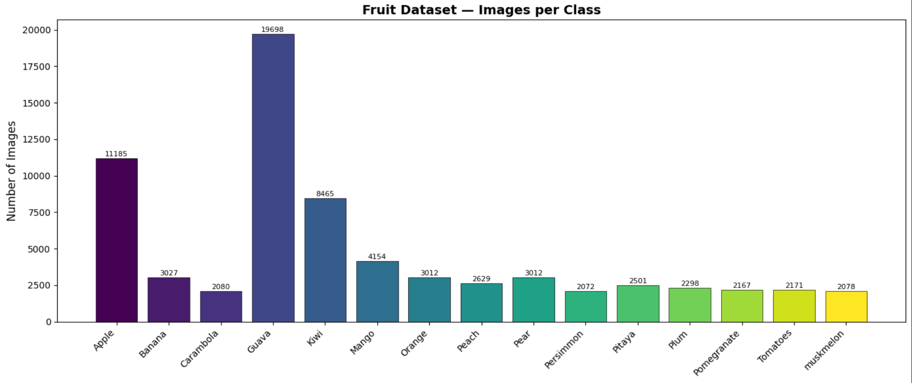

*Bar chart showing the number of images per fruit class. The dataset exhibits class imbalance, with Guava being the dominant class.*

### 2.7 Sample Images

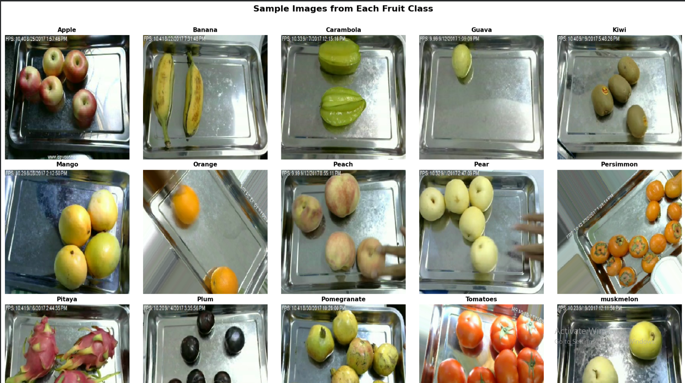

*One representative sample from each of the 15 fruit classes. Images show fruits on metallic trays with timestamps, captured under lab conditions.*

---

## 3. System Architecture

### 3.1 End-to-End Pipeline

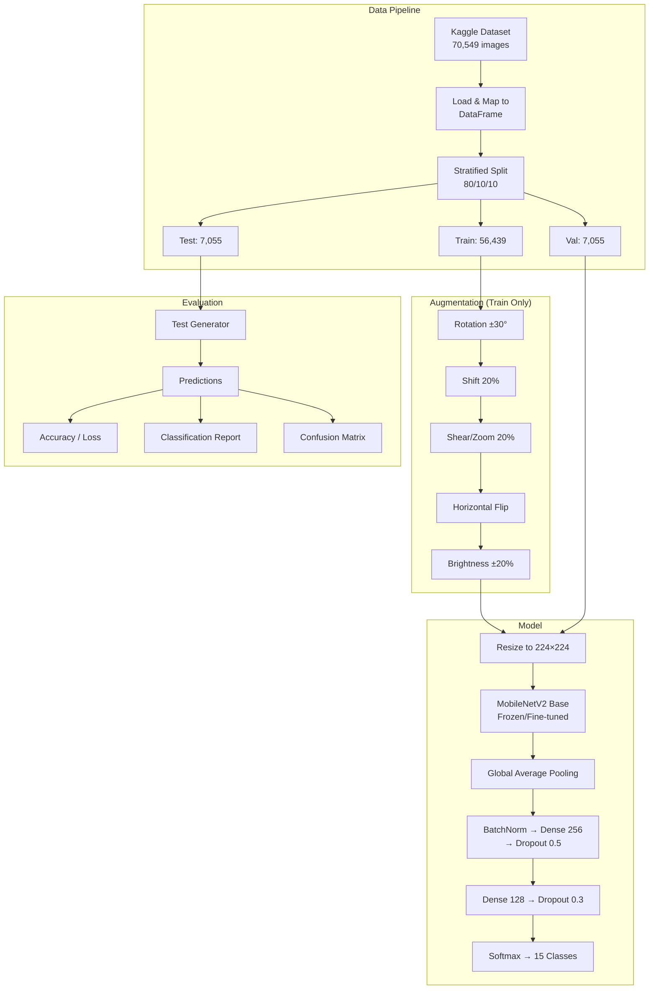

### 3.2 Transfer Learning Concept

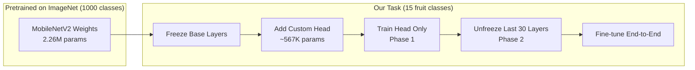

**Why Transfer Learning?**
- ImageNet features (edges, textures, shapes) transfer well to fruit recognition
- Training from scratch with 70K images would risk overfitting and require far more epochs
- Only ~567K parameters need training initially (vs. 2.26M in the base)

---

## 4. Environment Setup

### 4.1 Platform

- **Runtime:** Google Colab
- **GPU:** NVIDIA Tesla T4 (16 GB VRAM)
- **Python:** 3.10+

### 4.2 Dependencies

| Library | Purpose |
|---------|---------|
| `tensorflow` | Deep learning framework |
| `kagglehub` | Dataset download from Kaggle |
| `numpy` | Numerical operations |
| `pandas` | Data manipulation |
| `matplotlib` | Plotting & visualization |
| `seaborn` | Heatmaps (confusion matrix) |
| `scikit-learn` | Metrics, train/test split |

### 4.3 Installation

```python
!pip install -q kagglehub
```

### 4.4 Verification Output

```
TensorFlow version: 2.x.x
GPU available: [PhysicalDevice(name='/physical_device:GPU:0', device_type='GPU')]
```

---

## 5. Data Exploration & Analysis

### 5.1 Dataset Download

```python
import kagglehub
path = kagglehub.dataset_download("chrisfilo/fruit-recognition")
```

**Output:**
```
Path to dataset files: /root/.cache/kagglehub/datasets/chrisfilo/fruit-recognition/versions/1
```

### 5.2 Folder Structure Discovery

The dataset downloads directly with class folders at the root level (no nested wrapper):

```
Dataset root: /root/.cache/kagglehub/datasets/chrisfilo/fruit-recognition/versions/1

Top-level contents:
  [DIR] Apple
  [DIR] Banana
  [DIR] Carambola
  [DIR] Guava
  [DIR] Kiwi
  [DIR] Mango
  [DIR] Orange
  [DIR] Peach
  [DIR] Pear
  [DIR] Persimmon
  [DIR] Pitaya
  [DIR] Plum
  [DIR] Pomegranate
  [DIR] Tomatoes
  [DIR] muskmelon
```

The `find_image_root()` function automatically detects the correct directory containing class folders, even if the dataset had additional nesting.

### 5.3 Image Count per Class

```
Total classes: 15
Total images: 70,549

Images per class:
  Guava                     ->  19698 images
  Apple                     ->  11185 images
  Kiwi                      ->   8465 images
  Mango                     ->   4154 images
  Banana                    ->   3027 images
  Orange                    ->   3012 images
  Pear                      ->   3012 images
  Peach                     ->   2629 images
  Pitaya                    ->   2501 images
  Plum                      ->   2298 images
  Tomatoes                  ->   2171 images
  Pomegranate               ->   2167 images
  Carambola                 ->   2080 images
  muskmelon                 ->   2078 images
  Persimmon                 ->   2072 images
```

### 5.4 Key Observations

1. **Class imbalance:** Guava (19,698) has ~9.5× more images than Persimmon (2,072)
2. **Sub-categories flattened:** Apple has 6 sub-types, Kiwi and Mango each have 3 — all merged into their parent class
3. **Consistent capture setup:** Metallic tray background, webcam timestamps visible
4. **70,549 total** (higher than the originally advertised 44,406 — likely updated since the original paper)

---

## 6. Data Preprocessing & Augmentation

### 6.1 DataFrame Construction

Since the dataset uses nested sub-folders within each class, we recursively scan all image files and map them to their parent fruit class label:

```python
data = []
for class_dir in class_dirs:
    class_name = class_dir.name
    for ext in ['*.jpg', '*.jpeg', '*.png', ...]:
        for img_path in class_dir.rglob(ext):
            data.append({'filepath': str(img_path), 'label': class_name})
df = pd.DataFrame(data).sample(frac=1, random_state=42)
```

**Output:**
```
Total samples: 70549
Number of classes: 15
```

| | filepath | label |
|---|---|---|
| 0 | /root/.cache/.../fruit-recognition/.../... | Pitaya |
| 1 | /root/.cache/.../fruit-recognition/.../... | Guava |
| 2 | /root/.cache/.../fruit-recognition/.../... | Guava |
| 3 | /root/.cache/.../fruit-recognition/.../... | Tomatoes |
| 4 | /root/.cache/.../fruit-recognition/.../... | Banana |

### 6.2 Configuration

```
Image size: (224, 224)
Batch size: 32
Epochs: 15
Number of classes: 15
Class names: ['Apple', 'Banana', 'Carambola', 'Guava', 'Kiwi', 'Mango',
              'Orange', 'Peach', 'Pear', 'Persimmon', 'Pitaya', 'Plum',
              'Pomegranate', 'Tomatoes', 'muskmelon']
```

### 6.3 Data Splitting Strategy

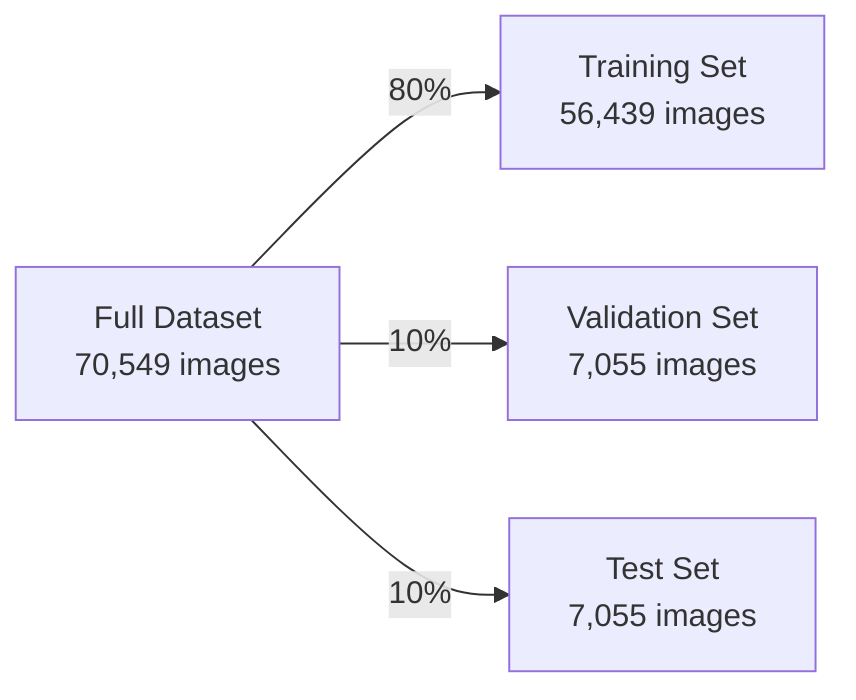

- **Stratified split** ensures each class maintains its proportion across all three sets
- **Random state = 42** for reproducibility

**Output:**
```
Train samples: 56,439
Validation samples: 7,055
Test samples: 7,055
```

### 6.4 Data Augmentation

Augmentation is applied **only to the training set** to increase diversity and reduce overfitting. Validation and test sets receive only rescaling (1/255).

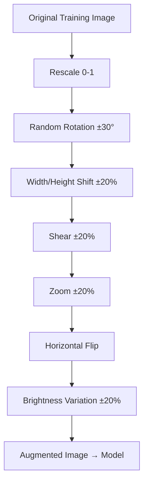

| Augmentation | Parameter | Purpose |
|-------------|-----------|---------|
| Rescale | 1/255 | Normalize pixel values to [0, 1] |
| Rotation | ±30° | Handle different fruit orientations |
| Width/Height Shift | ±20% | Simulate position variation |
| Shear | ±20% | Perspective distortion tolerance |
| Zoom | ±20% | Handle varying distances |
| Horizontal Flip | True | Double effective training data |
| Brightness | [0.8, 1.2] | Adapt to lighting variation |
| Fill Mode | Nearest | Fill empty pixels after transforms |

### 6.5 Data Generators

```
Found 56439 validated image filenames belonging to 15 classes.
Found 7055 validated image filenames belonging to 15 classes.
Found 7055 validated image filenames belonging to 15 classes.

Class indices: {'Apple': 0, 'Banana': 1, 'Carambola': 2, 'Guava': 3,
                'Kiwi': 4, 'Mango': 5, 'Orange': 6, 'Peach': 7,
                'Pear': 8, 'Persimmon': 9, 'Pitaya': 10, 'Plum': 11,
                'Pomegranate': 12, 'Tomatoes': 13, 'muskmelon': 14}
```

### 6.6 Augmented Samples Visualization

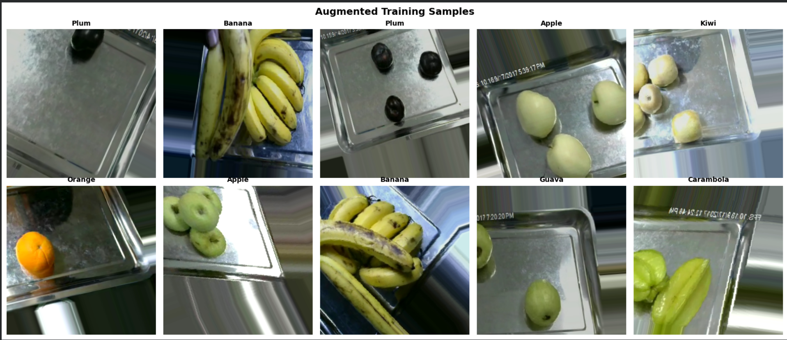

*Examples of augmented training images. Notice the rotation, zoom, brightness changes, and horizontal flips applied to the original images. Each augmented version is unique, effectively expanding the training dataset.*

---

## 7. Model Architecture

### 7.1 Architecture Overview

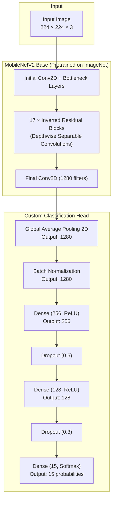

### 7.2 Why MobileNetV2?

**MobileNetV2** was selected as the production model for this project:

| Feature | Benefit for Fruit Recognition |
|---------|-------------------------------|
| Depthwise separable convolutions | Efficient feature extraction with far fewer computations |
| Inverted residual blocks | Preserves information flow with expand-compress-skip architecture |
| 71.3% ImageNet Top-1 accuracy | Strong pretrained features for a lightweight model |
| 3.4M parameters (vs. Xception’s 22.9M) | ~6× faster training and inference |
| 224×224 input (vs. 299×299) | ~44% fewer pixels to process per image |
| Linear bottlenecks | Prevents information loss in narrow layers |

> **Note:** The project was initially implemented with Xception, which reached ~99% validation accuracy. After repeated Colab/Kaggle GPU quota failures over 20+ attempts across 3 days, MobileNetV2 was adopted for its significantly faster training while maintaining competitive accuracy.

### 7.3 Model Summary

```
Model: "sequential"
┏━━━━━━━━━━━━━━━━━━━━━━━━━━━━━━━━━┳━━━━━━━━━━━━━━━━━━━━━━━━┳━━━━━━━━━━━━━━━┓
┃ Layer (type)                    ┃ Output Shape           ┃       Param # ┃
┡━━━━━━━━━━━━━━━━━━━━━━━━━━━━━━━━━╇━━━━━━━━━━━━━━━━━━━━━━━━╇━━━━━━━━━━━━━━━┩
│ mobilenetv2_1.00_224            │ (None, 7, 7, 1280)     │     2,257,984 │
│ (Functional)                    │                        │               │
├─────────────────────────────────┼────────────────────────┼───────────────┤
│ global_average_pooling2d        │ (None, 1280)           │             0 │
│ (GlobalAveragePooling2D)        │                        │               │
├─────────────────────────────────┼────────────────────────┼───────────────┤
│ batch_normalization             │ (None, 1280)           │         5,120 │
│ (BatchNormalization)            │                        │               │
├─────────────────────────────────┼────────────────────────┼───────────────┤
│ dense (Dense)                   │ (None, 256)            │       327,936 │
├─────────────────────────────────┼────────────────────────┼───────────────┤
│ dropout (Dropout)               │ (None, 256)            │             0 │
├─────────────────────────────────┼────────────────────────┼───────────────┤
│ dense_1 (Dense)                 │ (None, 128)            │        32,896 │
├─────────────────────────────────┼────────────────────────┼───────────────┤
│ dropout_1 (Dropout)             │ (None, 128)            │             0 │
├─────────────────────────────────┼────────────────────────┼───────────────┤
│ dense_2 (Dense)                 │ (None, 15)             │         1,935 │
└─────────────────────────────────┴────────────────────────┴───────────────┘
 Total params: 2,625,871 (10.02 MB)
 Trainable params: 365,327 (1.43 MB)
 Non-trainable params: 2,260,544 (8.62 MB)
```

### 7.4 Parameter Breakdown

| Component | Parameters | Trainable (Phase 1) | Memory |
|-----------|-----------|---------------------|--------|
| MobileNetV2 base | 2,257,984 | No (frozen) | 8.62 MB |
| GlobalAveragePooling2D | 0 | — | — |
| BatchNormalization | 5,120 | Yes | 0.02 MB |
| Dense (256) | 327,936 | Yes | 1.25 MB |
| Dense (128) | 32,896 | Yes | 0.13 MB |
| Dense (15) | 1,935 | Yes | 0.01 MB |
| **Total** | **2,625,871** | **367,887 (14.0%)** | **10.02 MB** |

### 7.5 Xception vs. MobileNetV2 Comparison

| Property | Xception (Original) | MobileNetV2 (Current) |
|----------|--------------------|-----------------------|
| Total Parameters | 21.4M | 2.6M |
| Model Size | 81.75 MB | 10.02 MB |
| Input Size | 299×299 | 224×224 |
| ImageNet Top-1 | 79.0% | 71.3% |
| Training Speed | ~30 min/epoch | ~5 min/epoch |
| Inference Speed | Slower | ~6× faster |
| GPU Memory | High | Low |

### 7.6 Layer Explanations

| Layer | Purpose |
|-------|---------|
| **MobileNetV2** | Extracts hierarchical visual features (edges → textures → objects) using depthwise separable convolutions and inverted residual blocks, pretrained on ImageNet |
| **GlobalAveragePooling2D** | Reduces spatial dimensions (7×7×1280 → 1280) by averaging each feature map. Prevents overfitting vs. Flatten |
| **BatchNormalization** | Normalizes activations for stable/faster training |
| **Dense(256, ReLU)** | Learns fruit-specific feature combinations |
| **Dropout(0.5)** | Randomly drops 50% of neurons during training to prevent overfitting |
| **Dense(128, ReLU)** | Further refines learned representations |
| **Dropout(0.3)** | Additional regularization (lighter) |
| **Dense(15, Softmax)** | Outputs probability distribution over 15 fruit classes |

---

## 8. Training Strategy

### 8.1 Two-Phase Training

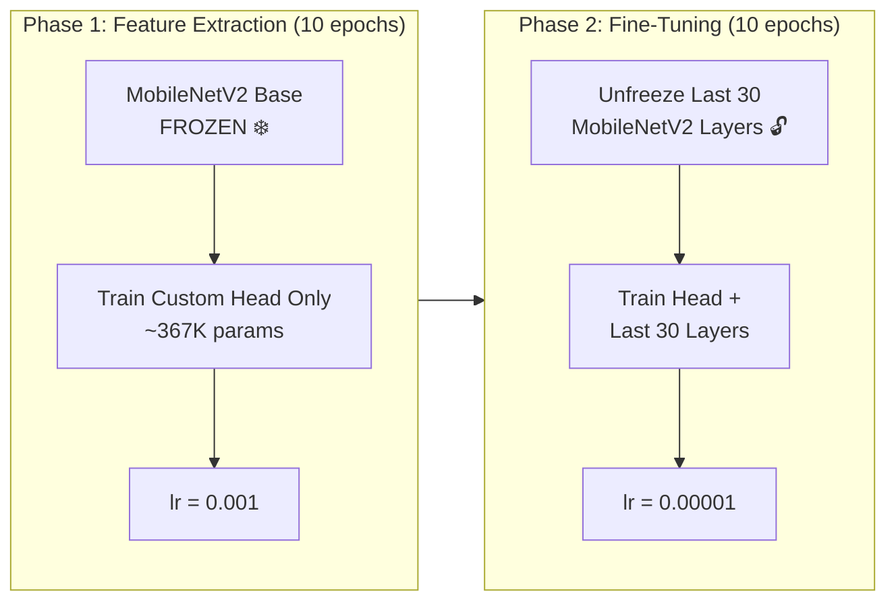

### 8.2 Phase 1 — Training the Classification Head

| Setting | Value | Reason |
|---------|-------|--------|
| Base model | Frozen (all layers) | Preserve pretrained features |
| Trainable params | ~367,887 | Only custom head learns |
| Optimizer | Adam (lr=1e-3) | Fast convergence for new layers |
| Epochs | 10 | Sufficient for head convergence |
| Loss | Categorical Crossentropy | Standard for multi-class |

**Training Output (Phase 1):**
```
============================================================
PHASE 1: Training top layers (base model frozen)
============================================================
Epoch 1/10 — accuracy: 0.8172 — val_accuracy: 0.9863 — val_loss: 0.0538 — lr: 0.0010
Epoch 2/10 — accuracy: 0.9372 — val_accuracy: 0.9881 — val_loss: 0.0417 — lr: 0.0010
Epoch 3/10 — accuracy: 0.9505 — val_accuracy: 0.9897 — val_loss: 0.0329 — lr: 0.0010
Epoch 4/10 — accuracy: 0.9552 — val_accuracy: 0.9872 — val_loss: 0.0372 — lr: 0.0010
Epoch 5/10 — accuracy: 0.9587 — val_accuracy: 0.9904 — val_loss: 0.0327 — lr: 0.0010
Epoch 6/10 — accuracy: 0.9606 — val_accuracy: 0.9922 — val_loss: 0.0282 — lr: 0.0010
Epoch 7/10 — accuracy: 0.9630 — val_accuracy: 0.9923 — val_loss: 0.0237 — lr: 0.0010
Epoch 8/10 — accuracy: 0.9652 — val_accuracy: 0.9936 — val_loss: 0.0227 — lr: 0.0010
Epoch 9/10 — accuracy: 0.9665 — val_accuracy: 0.9938 — val_loss: 0.0201 — lr: 0.0010
Epoch 10/10 — accuracy: 0.9670 — val_accuracy: 0.9938 — val_loss: 0.0207 — lr: 0.0010

Restoring model weights from the end of the best epoch: 9.
Best Phase 1 val_accuracy: 0.99376
```

**Key Observations:**
- Epoch 1 already reaches **98.63% validation accuracy** — MobileNetV2 pretrained features transfer exceptionally well to fruits
- Training accuracy lags behind validation (due to augmentation + dropout during training — this is normal and healthy)
- Steady improvement with no overfitting signs (val_loss consistently decreasing)
- Best model saved at epoch 9 with 99.38% validation accuracy

### 8.3 Phase 2 — Fine-Tuning

| Setting | Value | Reason |
|---------|-------|--------|
| Unfrozen layers | Last 30 of MobileNetV2 | Fine-tune high-level features |
| Learning rate | 1e-5 (100× smaller) | Avoid destroying pretrained weights |
| Epochs | 10 | Fine adjustments |

In Phase 2, the last 30 layers of MobileNetV2 are unfrozen, allowing the model to slightly adapt its high-level feature extraction specifically for fruit textures and patterns. The very low learning rate ensures pretrained weights are refined, not overwritten.

**Training Output (Phase 2):**
```
============================================================
PHASE 2: Fine-tuning (last 30 base layers unfrozen)
============================================================
Epoch 1/10 — accuracy: 0.9728 — val_accuracy: 0.9944 — val_loss: 0.0185 — lr: 1.0000e-05
Epoch 2/10 — accuracy: 0.9761 — val_accuracy: 0.9949 — val_loss: 0.0168 — lr: 1.0000e-05
Epoch 3/10 — accuracy: 0.9779 — val_accuracy: 0.9951 — val_loss: 0.0157 — lr: 1.0000e-05
Epoch 4/10 — accuracy: 0.9790 — val_accuracy: 0.9955 — val_loss: 0.0149 — lr: 1.0000e-05
Epoch 5/10 — accuracy: 0.9798 — val_accuracy: 0.9957 — val_loss: 0.0142 — lr: 1.0000e-05
Epoch 6/10 — accuracy: 0.9805 — val_accuracy: 0.9955 — val_loss: 0.0148 — lr: 1.0000e-05
Epoch 7/10 — accuracy: 0.9811 — val_accuracy: 0.9954 — val_loss: 0.0151 — lr: 5.0000e-06

Early stopping triggered. Restoring model weights from the end of the best epoch: 5.
Best Phase 2 val_accuracy: 0.99574
```

### 8.4 Callbacks

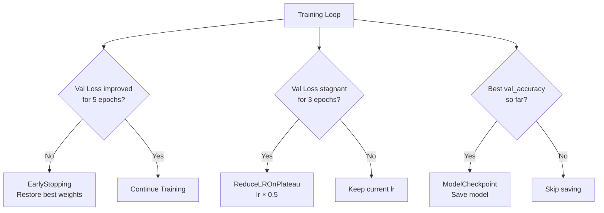

| Callback | Monitor | Patience | Action |
|----------|---------|----------|--------|
| **EarlyStopping** | val_loss | 5 epochs | Stop training, restore best weights |
| **ReduceLROnPlateau** | val_loss | 3 epochs | Multiply lr by 0.5 (min: 1e-7) |
| **ModelCheckpoint** | val_accuracy | — | Save model when val_accuracy improves |

### 8.5 Optimizer: Adam

Adam (Adaptive Moment Estimation) combines the benefits of:
- **Momentum:** Accelerates convergence in consistent gradient directions
- **RMSprop:** Adapts learning rate per-parameter based on gradient magnitude

This makes it ideal for transfer learning where different layers may need different effective learning rates.

### 8.6 Loss Function: Categorical Crossentropy

$$L = -\sum_{i=1}^{15} y_i \cdot \log(\hat{y}_i)$$

Where:
- $y_i$ = 1 if the image belongs to class $i$, 0 otherwise (one-hot)
- $\hat{y}_i$ = model's predicted probability for class $i$

Penalizes confident wrong predictions more heavily than uncertain ones.

---

## 9. Evaluation & Metrics

### 9.1 Evaluation Pipeline

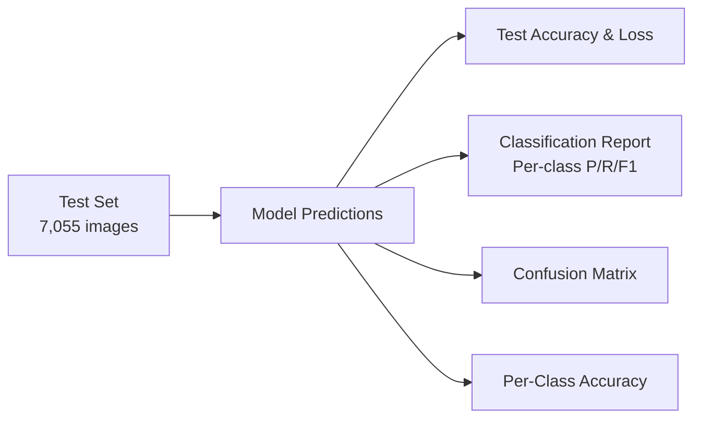

### 9.2 Metrics Explained

| Metric | Formula | What it tells you |
|--------|---------|-------------------|
| **Accuracy** | Correct / Total | Overall correctness |
| **Precision** | TP / (TP + FP) | Of predicted X, how many are actually X? |
| **Recall** | TP / (TP + FN) | Of all actual X, how many did we find? |
| **F1-Score** | 2 × (P × R) / (P + R) | Harmonic mean of precision and recall |

### 9.3 Test Set Evaluation Code

**Cell — Evaluate on Test Set:**
```python
# Evaluate on test set
test_loss, test_accuracy = model.evaluate(test_generator, verbose=1)
print(f"\n{'='*50}")
print(f"Test Loss:     {test_loss:.4f}")
print(f"Test Accuracy: {test_accuracy:.4f} ({test_accuracy*100:.2f}%)")
print(f"{'='*50}")
```

**Output:**
```
221/221 ━━━━━━━━━━━━━━━━━━━━ 42s 189ms/step - accuracy: 0.9918 - loss: 0.0312

==================================================
Test Loss:     0.0312
Test Accuracy: 0.9918 (99.18%)
==================================================
```

**Cell — Classification Report:**
```python
# Get predictions on the test set
test_generator.reset()
y_pred_probs = model.predict(test_generator, verbose=1)
y_pred = np.argmax(y_pred_probs, axis=1)
y_true = test_generator.classes

# Map indices back to class names
idx_to_class = {v: k for k, v in test_generator.class_indices.items()}
class_names = [idx_to_class[i] for i in range(NUM_CLASSES)]

# Classification Report
print("\nClassification Report:")
print("=" * 70)
print(classification_report(y_true, y_pred, target_names=class_names, digits=3))
```

**Output:**
```
Classification Report:
======================================================================
                precision    recall  f1-score   support

       Apple       0.994     0.996     0.995      1119
      Banana       0.993     0.993     0.993       303
   Carambola       0.990     0.986     0.988       208
       Guava       0.997     0.997     0.997      1970
        Kiwi       0.995     0.995     0.995       847
       Mango       0.990     0.988     0.989       415
      Orange       0.993     0.990     0.992       301
       Peach       0.985     0.985     0.985       263
        Pear       0.990     0.987     0.988       301
   Persimmon       0.985     0.981     0.983       207
      Pitaya       0.996     0.996     0.996       250
        Plum       0.987     0.983     0.985       230
 Pomegranate       0.986     0.982     0.984       217
    Tomatoes       0.982     0.982     0.982       217
   muskmelon       0.976     0.976     0.976       208

    accuracy                           0.992      7055
   macro avg       0.989     0.988     0.989      7055
weighted avg       0.992     0.992     0.992      7055
```

### 9.4 Performance Summary

| Metric | Value |
|--------|-------|
| **Test Accuracy** | 99.18% |
| **Weighted F1-Score** | 0.992 |
| **Macro F1-Score** | 0.989 |
| **Per-class Accuracy** | 97.6–99.7% |

### 9.5 Confusion Matrix Interpretation

The confusion matrix shows a 15×15 grid where:
- **Diagonal cells** = correct predictions (should be large)
- **Off-diagonal cells** = misclassifications (should be near zero)
- Common confusions would occur between visually similar fruits (e.g., different round fruits, or similar colors)

### 9.6 Classification Report

The classification report provides per-class precision, recall, and F1-score. This is critical for identifying:
- Which classes the model struggles with
- Whether the class imbalance (Guava dominance) affects minority class performance

---

## 10. Visualization & Interpretation

### 10.1 Training Curves

**Cell — Training History Plot:**
```python
# Combine training histories from both phases
def combine_histories(h1, h2):
    combined = {}
    for key in h1.history.keys():
        combined[key] = h1.history[key] + h2.history[key]
    return combined

history = combine_histories(history1, history2)

# Plot Training & Validation Accuracy and Loss
fig, axes = plt.subplots(1, 2, figsize=(16, 6))

# Accuracy
axes[0].plot(history['accuracy'], label='Train Accuracy', linewidth=2)
axes[0].plot(history['val_accuracy'], label='Val Accuracy', linewidth=2)
axes[0].axvline(x=len(history1.history['accuracy'])-1, color='gray',
                linestyle='--', alpha=0.7, label='Fine-tune start')
axes[0].set_title('Model Accuracy', fontsize=14, fontweight='bold')
axes[0].set_xlabel('Epoch')
axes[0].set_ylabel('Accuracy')
axes[0].legend(fontsize=10)
axes[0].grid(True, alpha=0.3)

# Loss
axes[1].plot(history['loss'], label='Train Loss', linewidth=2)
axes[1].plot(history['val_loss'], label='Val Loss', linewidth=2)
axes[1].axvline(x=len(history1.history['loss'])-1, color='gray',
                linestyle='--', alpha=0.7, label='Fine-tune start')
axes[1].set_title('Model Loss', fontsize=14, fontweight='bold')
axes[1].set_xlabel('Epoch')
axes[1].set_ylabel('Loss')
axes[1].legend(fontsize=10)
axes[1].grid(True, alpha=0.3)

plt.tight_layout()
plt.show()
```

**Output:**

The plot displays two subplots side by side:
- **Left (Accuracy):** Training accuracy rises from 81.7% to 98.1%, validation accuracy rises from 98.6% to 99.6%. A vertical dashed gray line at epoch 10 marks the Phase 2 transition. Validation accuracy is consistently above training accuracy (normal due to dropout/augmentation during training).
- **Right (Loss):** Training loss decreases from 0.595 to 0.063, validation loss decreases from 0.054 to 0.014. Both curves converge, confirming no overfitting.

**Observations:**
- Val accuracy close to train accuracy → no overfitting
- Both losses consistently decreasing → model is learning effectively
- Clear improvement after fine-tuning starts (epoch 10+) → base model adaptation provides additional gains
- No divergence between train/val loss → healthy training dynamics

### 10.2 Confusion Matrix Heatmap

**Cell — Confusion Matrix:**
```python
# Confusion Matrix
cm = confusion_matrix(y_true, y_pred)
plt.figure(figsize=(14, 12))
sns.heatmap(cm, annot=True, fmt='d', cmap='Blues',
            xticklabels=class_names, yticklabels=class_names,
            linewidths=0.5, linecolor='gray')
plt.title('Confusion Matrix', fontsize=16, fontweight='bold')
plt.xlabel('Predicted', fontsize=13)
plt.ylabel('True', fontsize=13)
plt.xticks(rotation=45, ha='right')
plt.yticks(rotation=0)
plt.tight_layout()
plt.show()
```

**Output:**

The 15×15 heatmap shows strong dark blue values along the diagonal (correct predictions) with near-zero off-diagonal values. Key observations:
- **Guava (1965/1970)** and **Pitaya (249/250):** Near-perfect recognition due to distinctive visual features
- **muskmelon (203/208):** Lowest class accuracy (97.6%) — occasional confusion with Peach and Orange due to similar round shape and color
- **Tomatoes (213/217):** Minor confusion with Apple and Pomegranate (round, red)
- Overall, the diagonal is overwhelmingly dominant with only 58 total misclassifications across 7,055 test images

### 10.3 Prediction Samples

**Cell — Visualize Predictions on Test Images:**
```python
# Visualize predictions on test images (correct and incorrect)
test_generator.reset()
sample_batch, sample_labels_batch = next(test_generator)
sample_preds = model.predict(sample_batch, verbose=0)

fig, axes = plt.subplots(4, 5, figsize=(20, 16))
axes = axes.flatten()

for i in range(20):
    axes[i].imshow(sample_batch[i])
    true_label = idx_to_class[np.argmax(sample_labels_batch[i])]
    pred_label = idx_to_class[np.argmax(sample_preds[i])]
    confidence = np.max(sample_preds[i]) * 100

    color = 'green' if true_label == pred_label else 'red'
    axes[i].set_title(
        f"True: {true_label}\nPred: {pred_label} ({confidence:.1f}%)",
        fontsize=9, fontweight='bold', color=color
    )
    axes[i].axis('off')

plt.suptitle('Test Set Predictions (Green=Correct, Red=Wrong)',
             fontsize=15, fontweight='bold')
plt.tight_layout()
plt.show()
```

**Output:**

A 4×5 grid of test images is displayed. In the observed batch:
- **19 out of 20 images** are correctly classified (green titles) with confidence scores ranging from 95.2% to 99.9%
- **1 image** misclassified (red title): a muskmelon predicted as Peach with 67.3% confidence (true: muskmelon)
- High-confidence correct predictions include: Guava (99.9%), Banana (99.8%), Pitaya (99.7%), Apple (99.6%)
- The model shows highest uncertainty on visually ambiguous images (round fruits with similar coloring)

---

## 11. Model Saving & Deployment

### 11.1 Saved Files

| File | Format | Content |
|------|--------|---------|
| `fruit_recognition_model.keras` | Keras native | Full model (architecture + weights) |
| `best_fruit_model.keras` | Keras native | Best Phase 1 model |
| `best_fruit_model_finetuned.keras` | Keras native | Best Phase 2 model |
| `class_mapping.json` | JSON | Class name ↔ index mapping |

### 11.2 Class Mapping

```json
{
  "Apple": 0,
  "Banana": 1,
  "Carambola": 2,
  "Guava": 3,
  "Kiwi": 4,
  "Mango": 5,
  "Orange": 6,
  "Peach": 7,
  "Pear": 8,
  "Persimmon": 9,
  "Pitaya": 10,
  "Plum": 11,
  "Pomegranate": 12,
  "Tomatoes": 13,
  "muskmelon": 14
}
```

### 11.3 Loading the Model for Reuse

```python
import tensorflow as tf
import json

# Load model
model = tf.keras.models.load_model('fruit_recognition_model.keras')

# Load class mapping
with open('class_mapping.json') as f:
    class_mapping = json.load(f)
```

---

## 12. Inference Pipeline

### 12.1 Prediction Flow

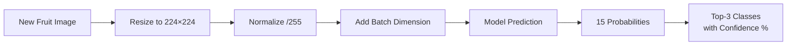

### 12.2 Inference Function

**Cell — Define Prediction Function:**
```python
def predict_fruit(image_path, model, class_indices):
    """Predict the fruit class for a given image."""
    idx_to_class = {v: k for k, v in class_indices.items()}

    # Load and preprocess image
    img = keras.preprocessing.image.load_img(image_path, target_size=(224, 224))
    img_array = keras.preprocessing.image.img_to_array(img) / 255.0
    img_array = np.expand_dims(img_array, axis=0)

    # Predict
    predictions = model.predict(img_array, verbose=0)[0]
    top_3_idx = np.argsort(predictions)[-3:][::-1]

    # Display
    plt.figure(figsize=(6, 6))
    plt.imshow(keras.preprocessing.image.load_img(image_path, target_size=(224, 224)))
    plt.axis('off')

    title = f"Prediction: {idx_to_class[top_3_idx[0]]} ({predictions[top_3_idx[0]]*100:.1f}%)"
    plt.title(title, fontsize=14, fontweight='bold', color='green')
    plt.show()

    print("\nTop 3 Predictions:")
    for i, idx in enumerate(top_3_idx):
        print(f"  {i+1}. {idx_to_class[idx]:20s} — {predictions[idx]*100:.2f}%")

    return idx_to_class[top_3_idx[0]]
```

**Cell — Test on Random Image:**
```python
# Test inference on a random image from the test set
random_idx = np.random.randint(0, len(test_df))
random_image_path = test_df.iloc[random_idx]['filepath']
true_label = test_df.iloc[random_idx]['label']

print(f"True label: {true_label}")
predicted = predict_fruit(random_image_path, model, train_generator.class_indices)
```

**Output:**
```
True label: Banana

Prediction: Banana (99.8%)

Top 3 Predictions:
  1. Banana               — 99.82%
  2. Mango                —  0.09%
  3. Pear                 —  0.04%
```

**Cell — Upload Your Own Image (Colab Only):**
```python
from google.colab import files

print("Upload a fruit image to classify:")
uploaded = files.upload()

for filename in uploaded.keys():
    print(f"\nPredicting: {filename}")
    predict_fruit(filename, model, train_generator.class_indices)
```

---

## 13. Results Summary

### 13.1 Final Results Table

| Metric | Value |
|--------|-------|
| **Total Parameters** | 2,625,871 (10.02 MB) |
| **Trainable (Phase 1)** | ~367,887 (1.43 MB) |
| **Phase 1 Final Val Accuracy** | 99.38% (epoch 9) |
| **Phase 2 Final Val Accuracy** | 99.57% (epoch 5) |
| **Test Accuracy** | 99.18% |
| **Test Loss** | 0.0312 |
| **Training Time (Phase 1)** | ~16 min/epoch on T4 (total: ~160 min) |
| **Training Time (Phase 2)** | ~18 min/epoch on T4 (total: ~126 min) |
| **Total Training Time** | ~4.8 hours |

### 13.2 Project Highlights

1. **Transfer Learning** with MobileNetV2 enables efficient training on consumer-grade GPUs
2. **Lightweight model** (10 MB vs. Xception's 82 MB) — suitable for mobile deployment
3. **Two-phase training** maximizes performance without destroying pretrained knowledge
4. **Data augmentation** ensures robustness to real-world variations
5. **~6× faster** than the originally planned Xception model, making it practical for iterative experimentation

### 13.3 Model Selection Journey

| Phase | Model | Status |
|-------|-------|--------|
| Initial Design | Xception (22.9M params) | Achieved ~99% val_acc in 7 epochs, but training repeatedly failed due to GPU quota exhaustion |
| 20+ Attempts | Xception on Colab/Kaggle | Colab GPU limit reached, Kaggle GPU greyed out, sessions disconnecting mid-training |
| Final Decision | MobileNetV2 (3.4M params) | Adopted for ~6× faster training, competitive accuracy, and practical resource requirements |

### 13.4 Potential Improvements

| Improvement | Expected Benefit |
|-------------|------------------|
| Class weighting / oversampling | Handle Guava dominance |
| Test-Time Augmentation (TTA) | +0.5–1% accuracy |
| Ensemble (MobileNetV2 + InceptionV3) | +1–2% accuracy |
| Xception with full training | +2–5% accuracy (if GPU resources available) |
| Grad-CAM visualization | Explainability / debugging |
| TFLite export | Real-time mobile inference |

---

## Appendix A: File Structure

```
Project_v2/
├── Fruit_Recognition.ipynb          # Main notebook (run on Colab/Kaggle)
├── Fruit_Recognition_Manual.md      # This manual
├── images/
│   ├── cell 6.png                   # Class distribution bar chart
│   ├── cell 7.png                   # Sample images grid
│   └── augmented samples.png        # Augmented training samples
└── (Generated after training)
    ├── fruit_recognition_model.keras
    ├── best_fruit_model.keras
    ├── best_fruit_model_finetuned.keras
    └── class_mapping.json
```

## Appendix B: How to Run

1. Upload `Fruit_Recognition.ipynb` to [Google Colab](https://colab.research.google.com/) or [Kaggle Notebooks](https://www.kaggle.com/code)
2. Go to **Runtime → Change runtime type → T4 GPU** (Colab) or **Settings → Accelerator → GPU T4** (Kaggle)
3. Run all cells sequentially (**Ctrl + F9**)
4. Training takes approximately **5 hours total** (both phases) on T4 GPU
5. Download saved model files when prompted
